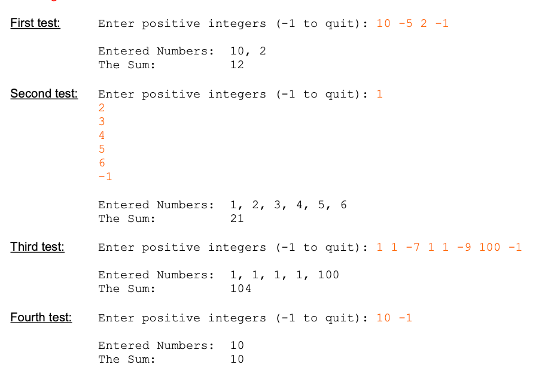

Program #1 (17 points): Write a Java program, named InputSum, which prompts the user to enter positive integer numbers using a sentinel while loop. The program should accept integer inputs until the user enters the value -1 (negative one is the sentinel value that stops the while loop). After the user enters -1, the program should display the entered numbers followed by their sum as shown below. Notice that value -1 is not part of the output. The program should ignore any other negative input and should continue to run.

Make sure the program validates each entered number before processing it as the user may enter negative numbers (other than the sentinel value -1).

Hint: to remember/save the entered (good) positive values, you can concatenate them into a string (separated by comas) that you can output later on.

Design your program such that it allows the user to re-run the program with a different set of inputs in the same run (i.e., use a sentinel loop, see example on slide 48, chapter 5). This characteristic/behavior will be required for future programs, so please make sure you learn how to code sentinel loops in your programs going forward.

Document your code, organize, and space out your outputs as shown below. The following sample tests show the input prompt and the output labels. Notice the user may enter all values on one line (first test) or one value per line (second test). DO NOT read inputs as String type. Make sure your code displays the outputs following the test data format

tests info doesn't copy paste, so pasted image (must view in preview mode)

