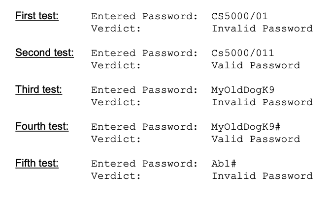

Program #2 (17 points): 
Write a Java program, named PasswordTest, that reads from the user a string input (representing a password) and determines whether the password is “Valid Password” or “Invalid Password”. 

A valid password has at least 7 characters and includes at least one lower-case letter, at least one upper-case letter, at least one digit, and at least one character that is neither a letter nor a digit. 

Your program will need to check each character in the string in order to render a verdict. 

For example, CS5000/01 is invalid password; however, Cs5000/01 is a valid password. 

The program should display the entered password followed by the judgment as shown below.
Document your code, organize, and space out your outputs as shown below. 

Design your program such that it allows the user to re-run the program with different inputs in the same run (i.e., use a sentinel loop structure, see example on slide 48). 

The following sample tests show only the outputs. Make sure your code displays the outputs following the test data format.

