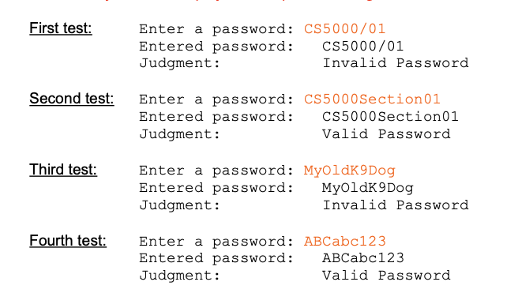

Program #1 (25 points): Write a Java program, named Password. 

In the program, design and implement a method (named CheckPassword) that takes a string password as a parameter, determines whether the password is valid or invalid using the following rules. 

The method then returns the outcome as a boolean value (true or false).

The rules are:
- Password must include at least 9 characters
- Password contains only letters and digits
- Password must include at least 3 digits
- Password must include at least 3 lower-case letters
- Password must include at least 3 upper-case letters

Develop five additional boolean methods, one for each stated rule above, to check if that rule is met or not. 

A password is valid if all five methods return true values, otherwise the password is invalid. 

Design the program main method such that it allows the user to re-run the program with different inputs (as we did in the previous assignment using a sentinel loop structure). 

Document your code and organize the outputs properly using escape characters. 

In the main method, ask the user to enter a password and then display the judgement “Valid Password” or “Invalid Password”. 

Sample test data below show both input prompts and output labels. Make sure your code displays the outputs following the test data format.

